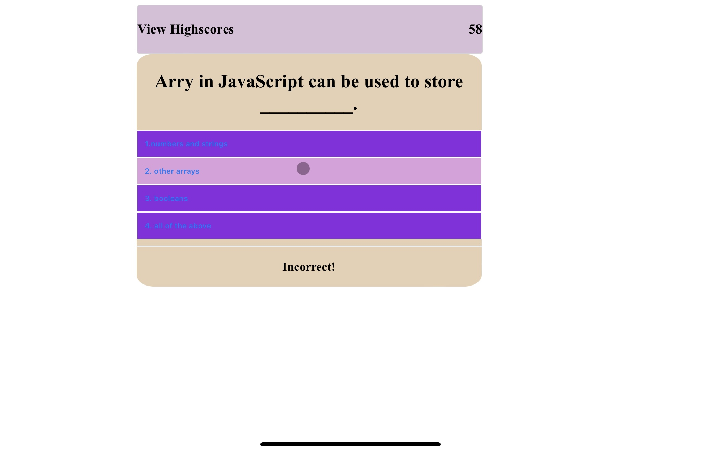
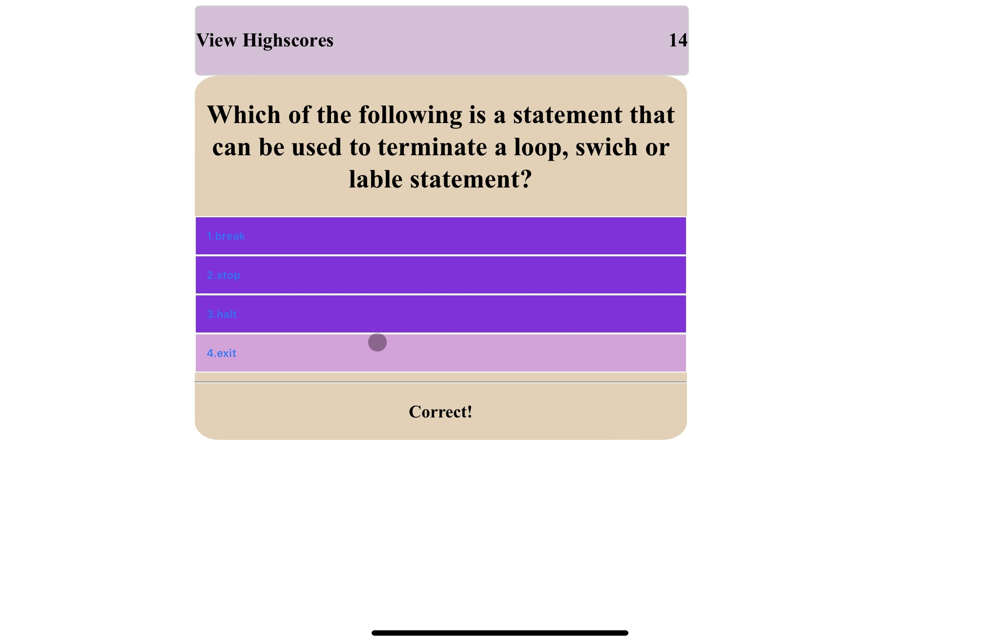
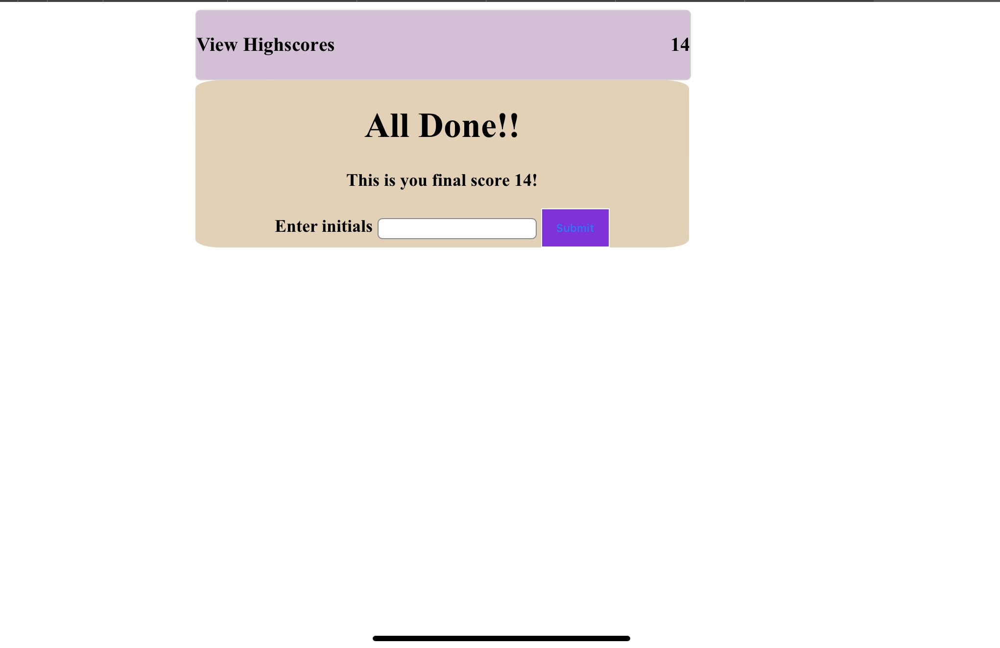
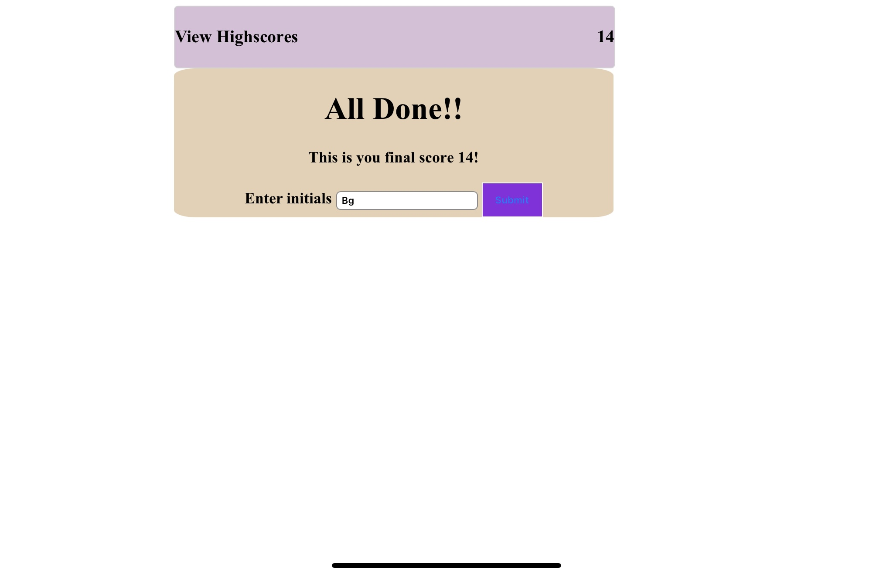

# simple-code-quiz

# Description

I done this to test my skills to what is took to bulid a online quiz. This is a quiz to test a beginners skills on the knowlege that they have learned on the ideas and concepts of Html/CSS and JavaScript. This solves the idea of how you can test anyone in the world on the simple concepts of Html/CSS and JavaScript. With learning how to make a online quiz I got to see how all three concepts can be linked together and work seamlessly.

## Usage

This is the starting page of the quiz. 
.jpeg)

 When you click the start button it will have a hover effect and let you know that you are about to start the quiz.
.jpeg)

As you can see you will be able to see hover effect over the questons and see if you got a queston correct or incorrect. Also when you are taking the quiz there is a time limit. and for every wrong answer the time will drop 10 seconds.Plus when the time is up you will be brought to the All Done screen.

Once you finish the quiz you will see the amount of time you have left and be able to write your initials for the quiz.

